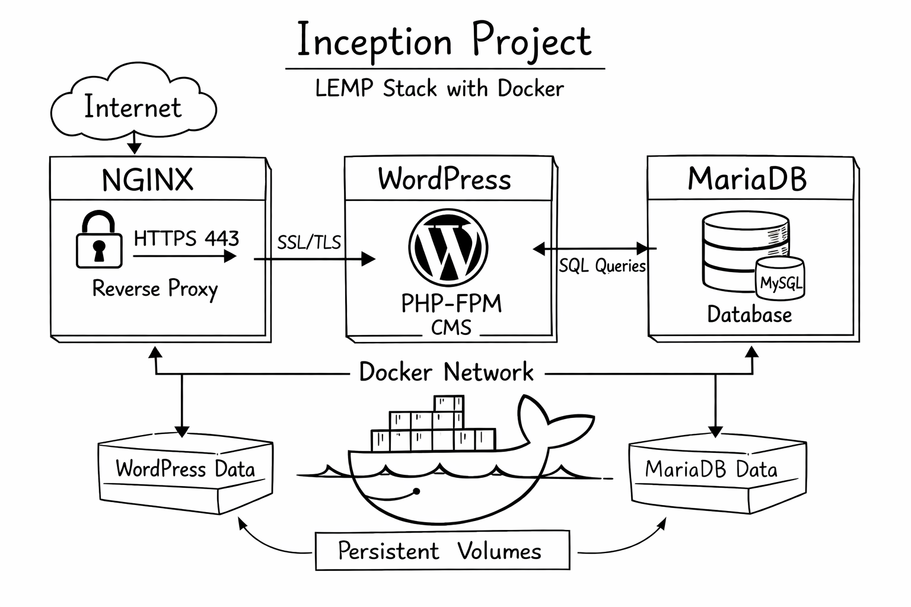

# Hi, I'm Hatice 👋

**QA Automation Engineer | Backend Developer**  
42 Türkiye  
Building reliable systems through testing & engineering  
Turning coffee & metal riffs into code 🤘

---

##  About Me

-  Specialized in **Test Automation & Quality Engineering**
-  Backend-focused software engineer
-  Designing scalable UI & API test architectures
-  Passionate about clean architecture and problem solving

---

##  Tech Stack

### Backend & Development

### QA & Automation

### DevOps & Tools

---

##  Featured Projects

### Test Automation Frameworks

| Project | Description | Highlights |
|---|---|---|
| **ISTQB Automation** | Automation project implementing formal test design techniques based on ISTQB principles. | Decision Table Testing, Boundary Value Analysis, structured test coverage |
| **E-Commerce Framework** | Scalable UI & API automation framework designed for modern e-commerce systems. | Parallel execution, API validation, schema-based assertions |
| **E2E UI Framework** | Maintainable Selenium-based end-to-end test architecture focused on stability and scalability. | ThreadLocal WebDriver, Page Object Model, Headless CI execution |
### 🐳 Inception — Infrastructure Virtualization

A system administration project focused on containerizing a complete web infrastructure using Docker.  
Each service runs inside an isolated container built from scratch on Debian Bullseye, following DevOps and security best practices.

**Tech Stack**
- Docker & Docker Compose
- NGINX (Reverse Proxy)
- WordPress + PHP-FPM
- MariaDB
- Debian Bullseye
- TLSv1.3

**Architecture Highlights**
- NGINX configured as HTTPS entry point (port 443 only)
- Secure internal Docker network for service communication
- Persistent data management using Docker volumes
- Hardened database configuration (internal access only)
- Automated infrastructure lifecycle via Makefile

**Key Concepts**
- Container isolation
- Infrastructure as Code
- Secure networking
- Persistent storage design

---

### Full Stack Development

#### PONG Game Platform

A real-time multiplayer web application developed within the 42 curriculum, focusing on scalable backend architecture and live communication systems.

**Tech Stack**
- Fastify (Node.js)
- WebSocket real-time communication
- JWT Authentication & 2FA
- TypeScript
- BabylonJS

**Key Features**
- Real-time multiplayer matches
- Tournament management system
- Modular and scalable backend structure
- Secure authentication flow

---

### Mobile Development

#### StreetPaws Mobile App

A social impact mobile application designed to connect volunteers with local animal support activities through location-based interaction.

**Tech Stack**
- React Native + Expo
- QR-based task tracking
- Map integration services

**Highlights**
- Volunteer coordination workflow
- Real-world interaction via QR system
- User-friendly mobile-first design

---

  

---

##  Connect With Me

---

⭐ *Always improving systems, tests, and myself.*
